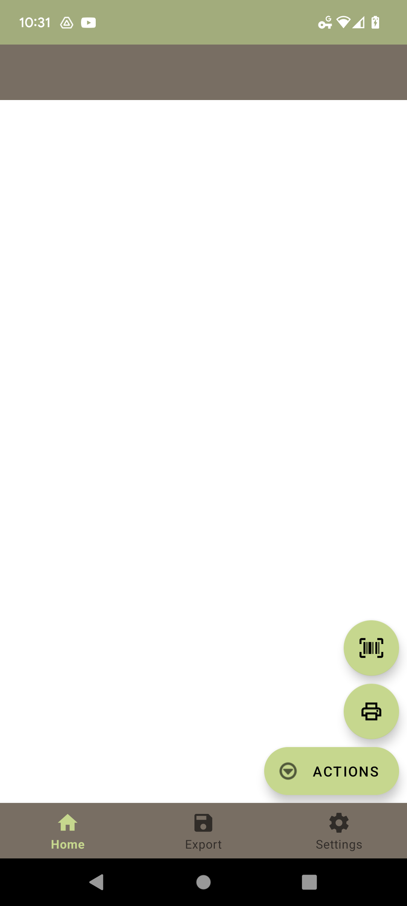
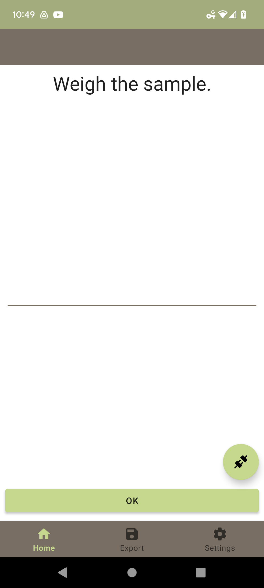
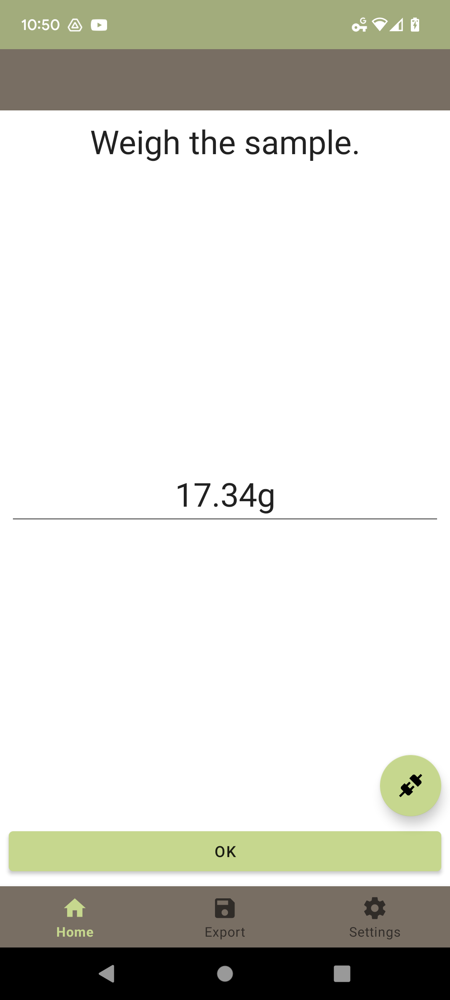
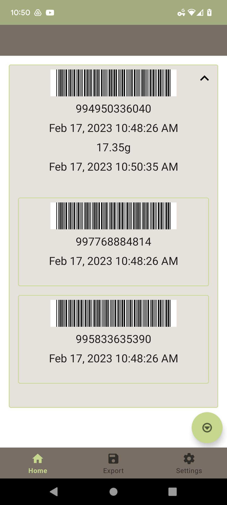
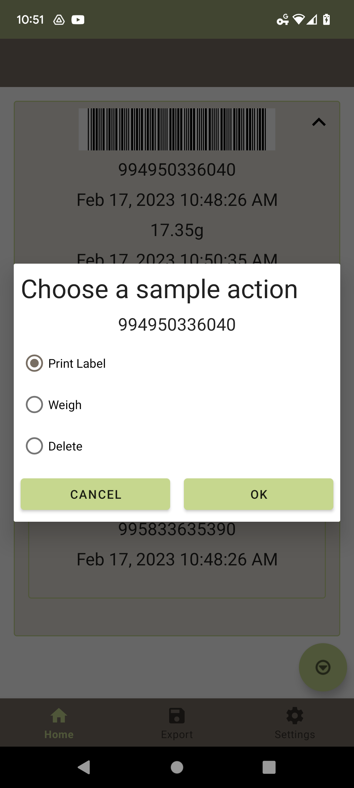
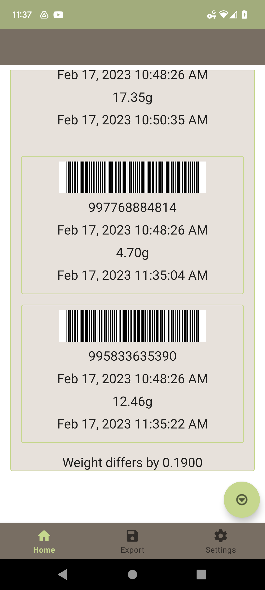
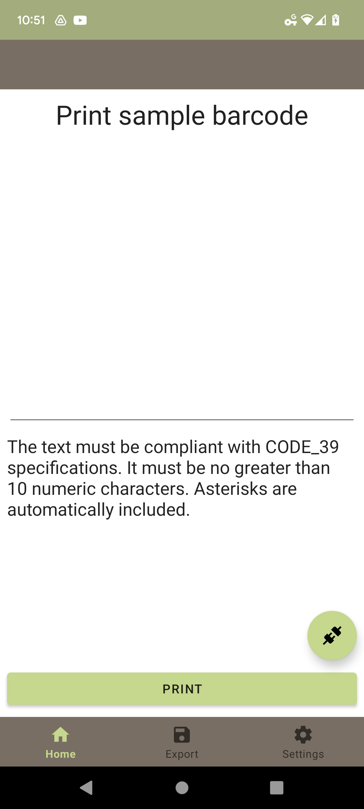

# Cotton Workflow Android App

## Overview

The cotton workflow app is designed to flow through a pre-defined process. The process is defiend as:

```
1. Scan a sample barcode
2. Generate two subsamples and print them as labels
3. Weigh the original sample
4. User manually scans subsample barcodes to initiate a weigh
5. Analyze the difference between the subsample and original weight
```

This application follows this workflow, but also includes features to manually accomplish each option in the case where a device is not available or connected.

## Barcode Specification

```
Barcode spec: https://www.cottoninc.com/cotton-production/ag-research/variety-improvement/breeder-fiber-sample-information/

Taken from above reference:
Font: SKANDATArC39
Code must begin with *99 and end with *
Code will contain a total of 12 numbers as shown in example below
Example: *991122345678*
No symbols or alphanumeric characters
```

Notice this is actually the CODE_39 barcode standard with an added '99' at the beginning of the code. In-app code text representation never includes * but these are automatically included in the generated barcodes/labels.


## Storage Definer

The app starts by asking to define a storage location.
Currently no storage is actually used in the app.

<p align="center">
	
</p>

## Main Page

At first load, the main page is empty. The user can click the action icon to choose between print or scan. Scan is the main option and can be used to immediatelly scan a barcode and begin workflow. Print is an optional action for printing manual labels.

<p align="center">
	
	
</p>

## Zebra Barcode Scanner

Scanning uses the Zebra API, scans CODE_39 barcodes.

<p align="center">
	
</p>

After a parent sample scan, two new samples are inserted into the database, and two print jobs are queued to print the subsample labels. If a printer is not set in the preferences, this is essentially skipped and the user must manually print on the main screen.

## Weigh

The weigh sample screen is immediately opened when a sample is scanned. This page will automatically attempt to connect to a bonded scale (set in the preferences). Users can opt to manually enter the weight. Right now only grams is supported, but there is potential for other units. 

<p align="center">
	
	
</p>

Users can also click the connect button to open the device chooser, this will set the device in preferences when selected. This screen is used to choose a printer in the print screen and also to choose either device in the preferences. 

<p align="center">
	
</p>

## Main Page With Content

When the main page has content, a list view shows all samples. Each parent sample can expand to show its generated subsamples. 

Samples have the following content in top-to-bottom order: a CODE_39 barcode preview image, the text representation of the barcode (without CODE_39 asterisks), the timestamp when the sample was first scan, or when the subsample was generated, the weight in grams, finally the timestamp when the weight was taken.

<p align="center">
	
</p>

Any sample/subsample can be clicked to show delete, print, or weigh options. This screen is also opened if a sample/subsample is scanned and already contains data.

<p align="center">
	
</p>

When a sample, and its two subsamples are weighed, an analysis shows the difference in weight.

<p align="center">
	
</p>

## Manual Print

Similar to the weigh screen, users can manually print any string within the given constraints.

<p align="center">
	
</p>

## Settings

Users can select printer/scale addresses or clear them from the preferences.

<p align="center">
	
</p>


