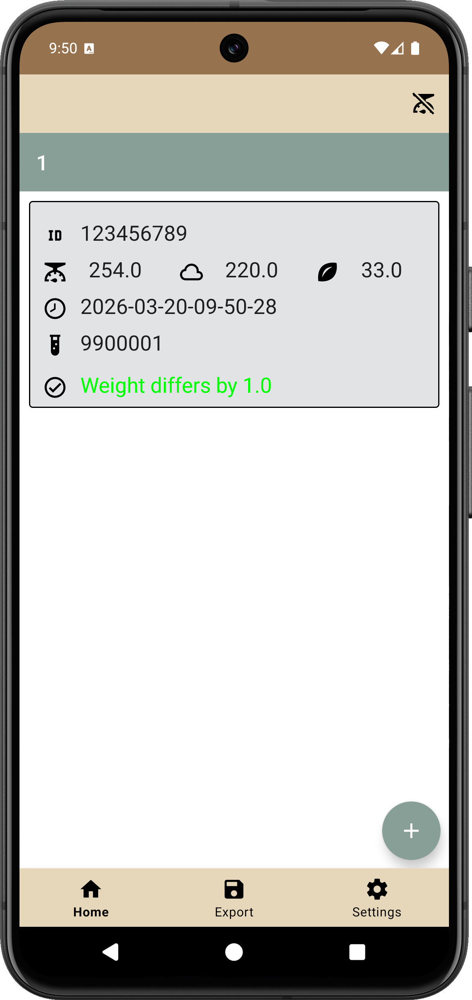
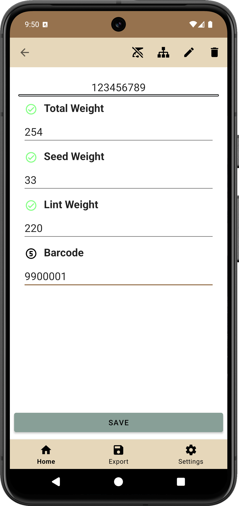
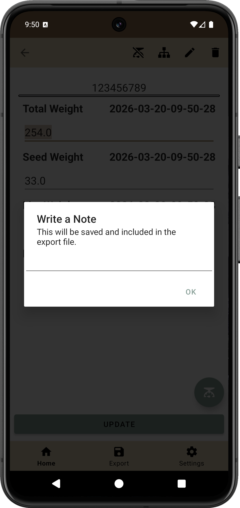
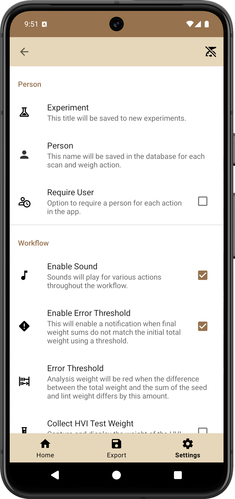
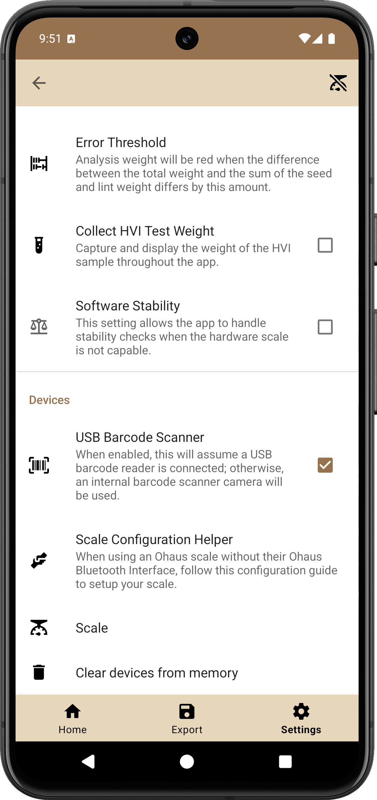

# Cotton Workflow Android App

## Hardware

| Item              | Manufacturer | Model            | Price | Vendor                                                                                                                                                             |
|-------------------|--------------|------------------|-------|--------------------------------------------------------------------------------------------------------------------------------------------------------------------|
| Tablet            | Lenovo       | M9               | $140  | [Lenovo](https://www.lenovo.com/us/en/p/tablets/android-tablets/lenovo-tab-series/lenovo-tab-m9-9-inch-mtk/len103l0016)                                            |
| Scale             | Ohaus        | Ranger 3000      | $580  | [ScalesGalore](https://www.scalesgalore.com/product/Ohaus-30031708-Ranger-3000-Compact-Bench-Scale-6-lb-x-00002-lb-and-Legal-for-Trade-6-lb-x-0002-lb-px36329.cfm) |
| Bluetooth adapter | SerialIO     | BlueSnap DB9-M6A | $115  | [SerialIO](https://buy.serialio.com/products/bluesnap-smart-db9-m6a)                                                                                               |
| Barcode scanner   | Alacrity     | 2D Bluetooth     | $75   | [Amazon](https://www.amazon.com/dp/B0823LYJZX)                                                                                                                     |

## Overview

The cotton workflow app is designed to flow through a pre-defined ginning and phenotyping process:

```
1. Tare the scale to the bag size the samples are collected in.
2. Use a barcode scanner and scan the bag.
3. Weigh the bag with the cotton sample inside.
4. Gin the sample.
5. Collect the fuzzy seed, place back into original bag, and weigh the bag.
6. Grab the lint, place it on top of an empty bag, and weigh.
7. Remove 25 grams of lint and place inside a labeled 2lb bag for HVI.
8. Scan the subsample barcode.
9. Discard the remaining lint.
```

## Main Page

A list view shows all samples on the main page.
Each sample card displays the sample ID, a timestamp when the sample was created, total sample weight, seed weight, and lint weight, and the difference between total weight and the sum of component weights.

<p align="center">
	
</p>

## Workflow

During a workflow, the app reads from the connected scale and automatically fills in the next data field.
The app detects new weigh-actions between every reading of 0.0g, so a new weight isn't saved until the scale is emptied or zeroed.
The data is filled in this order: total weight, seed weight, lint weight, test weight.
Test weight does not wait for 0.0g, but waits until a certain weight difference threshold is met then notifies the user and opens a barcode scanner to scan the Test label.
When each weight is saved, the timestamp is saved as well.
If the user clicks an item to edit any weight, the workflow is considered interrupted and does not continue.
Besides the workflow screen, users can open a weigh screen that will only apply to that specific sample.

<p align="center">
	
	
</p>

## Settings

<p align="center">
	
	
</p>
