# Cotton Workflow Android App

## Hardware

| Item              | Manufacturer | Model            | Price | Vendor                                                                                                                                                             |
|-------------------|--------------|------------------|-------|--------------------------------------------------------------------------------------------------------------------------------------------------------------------|
| Tablet            | Lenovo       | M9               | $140  | [Lenovo](https://www.lenovo.com/us/en/p/tablets/android-tablets/lenovo-tab-series/lenovo-tab-m9-9-inch-mtk/len103l0016)                                            |
| Scale             | Ohaus        | Ranger 5000      | $520  | [ScalesGalore](https://www.scalesgalore.com/product/Ohaus-30031708-Ranger-3000-Compact-Bench-Scale-6-lb-x-00002-lb-and-Legal-for-Trade-6-lb-x-0002-lb-px36329.cfm) |
| Bluetooth adapter | SerialIO     | BlueSnap DB9-M6A | $105  | [SerialIO](https://buy.serialio.com/products/bluesnap-smart-db9-m6a)                                                                                               |
| Barcode scanner   | Alacrity     | 2D Bluetooth     | $75   | [Amazon](https://www.amazon.com/dp/B0823LYJZX)                                                                                                                     |

## Overview

The cotton workflow app is designed to flow through a pre-defined process. The process is defiend as:

```
 We tare the scale to the bag size the samples are collected in. (12lb, 16lb, or 25lb bag)
    We use a barcode scanner and scan the bag.
    Then we weight the bag with the cotton sample inside.
    Then we gin the sample.
    We collect the fuzzy seed and place back into original bag
        We weigh the bag with the fuzzy seeds inside.
    Next we grab the lint,  and place it on top of a bag that matches the sample bag(empty bag). Get the lint weight.
        Remove 25 grams of lint.
        25 grams of lint is place inside a labeled 2lb bag( for HVI testing). This bag is scanned as well.
    The remaining lint is thrown away or kept.
    Repeat the process.
    We  use the error check for any samples that are +/-5
```

This application follows this workflow, but also includes features to manually accomplish each option in the case where a scale is not available or connected. 

## Barcode Specification

```
Barcode spec: https://www.cottoninc.com/cotton-production/ag-research/variety-improvement/breeder-fiber-sample-information/

Taken from above reference:
Font: SKANDATArC39
Code must begin with *99 and end with *
Code will contain a total of 12 numbers as shown in example below
Example: *991122345678*
No symbols or alphanumeric characters
```

Notice this is actually the CODE_39 barcode standard with an added '99' at the beginning of the code. In-app code text representation never includes * but these are automatically included in the generated barcodes/labels.


## Storage Definer

The app starts by asking to define a storage location.
Currently no storage is actually used in the app.

<p align="center">
	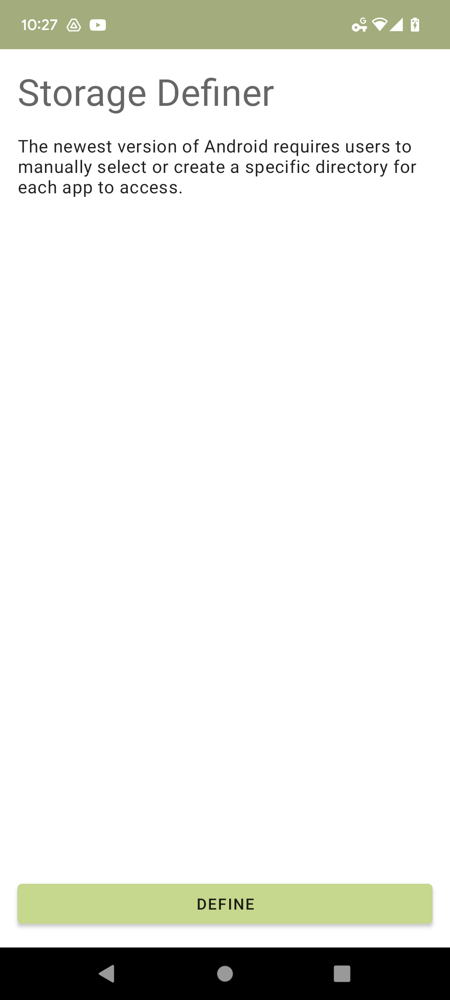
</p>

## Main Page

At first load a barcode scanner will be opened to scan the first sample. If a barcode is scanned, a weigh workflow automatically begins, otherwise the main page is shown. On the main page, the user can click the scan icon to reopen the scanner. If a barcode is scanned, the app navigates to the workflow fragment.

<p align="center">
	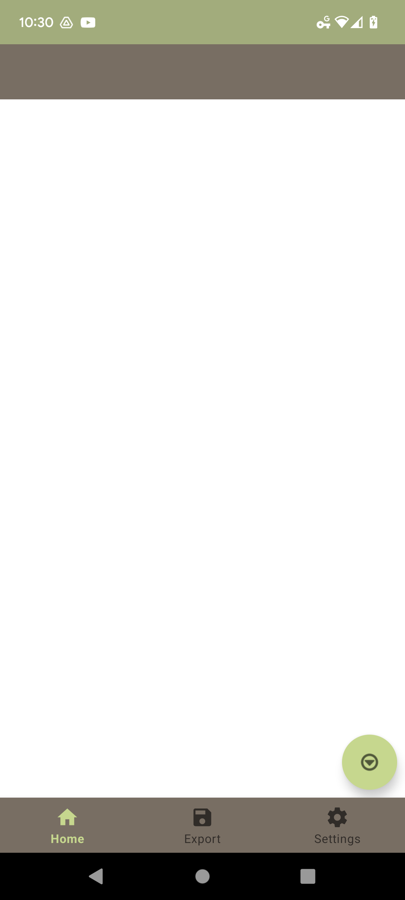
</p>

## Zebra Barcode Scanner

Scanning uses the Zebra API, scans CODE_39 barcodes.

<p align="center">
	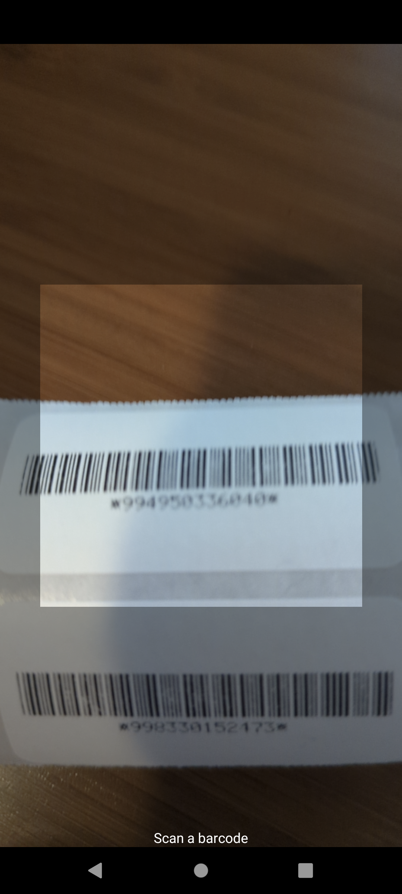
</p>

After a new parent sample is scanned, three new subsamples are inserted into the database to track various metadata. The seed, lint, and test subsamples.

## Workflow

During a parent workflow, the app reads from the connected scale and automatically fills in the needed data in order. The app detects new weigh-actions between every reading of 0.0g. Therefore, a new weight isn't saved until the scale is emptied or zeroed. The data is filled in this order: total weight, seed weight, lint weight, test weight. Test weight works differently, it does not wait for 0.0g and waits until a certain weight difference threshold is met then notifies the user and opens a barcode scanner to scan the Test label. When each weight is saved, the timestamp is saved as well. If the user clicks an item to edit any weight, the workflow is considered interrupted and does not continue.

The workflow screen has an optional edit mode that does not connect to a scale.

Besides the workflow screen, users can open a weigh screen that will only apply to that specific sample. This screen connects to a scale, but if the user interrupts by manually entering data the scale readings will not apply for 15 seconds.

<p align="center">
	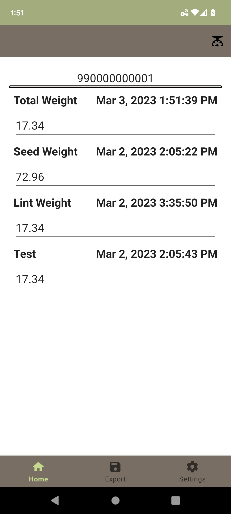
	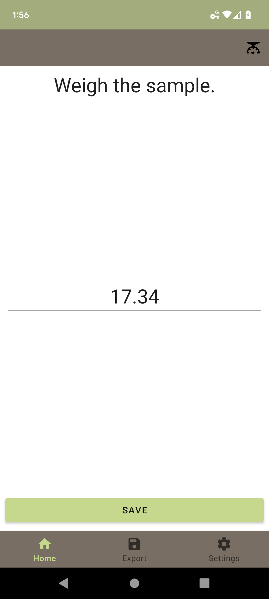
</p>

Users can click the top toolbar scale icon to choose their device at any point.

<p align="center">
	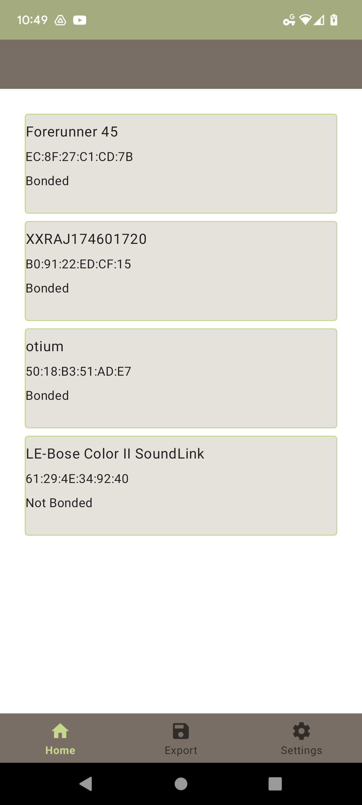
</p>

## Main Page With Content

When the main page has content, a list view shows all samples. Each parent sample can expand to show its generated subsamples. 

Samples show different data depending on their type. Parent samples show their barcode, weight, time metadata, and error analysis. Seed samples only show weight and time metadata, because they share a barcode with the parent. Lint samples only show weight/time because they are never assigned a barcode. Test samples show all data, but if the user skips the barcode scan this will show as unscanned, until the user fills this data. 

<p align="center">
	
	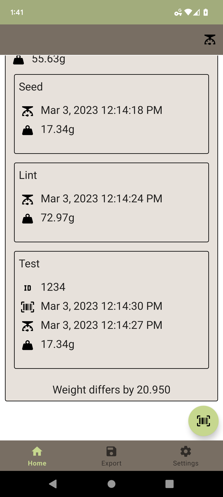
	
</p>


Each sample/subsample has different actions depending on its type.

```
Parent actions:
	1. Weigh: manual weigh screen
	2. Workflow: restart workflow screen
	3. Edit: open workflow screen in edit mode
	4. Delete: delete this sample and all subsamples
```

<p align="center">
	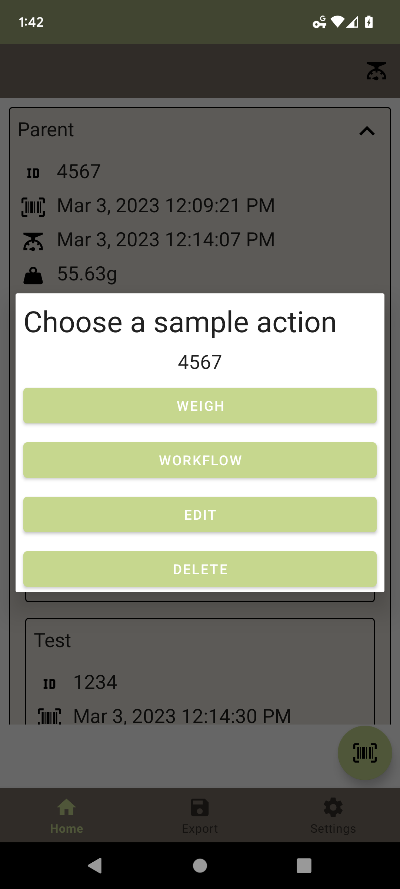
</p>

```
Seed and Lint actions:
	1. Weigh: manual weigh screen
	2. Edit: open workflow screen in edit mode
```

<p align="center">
	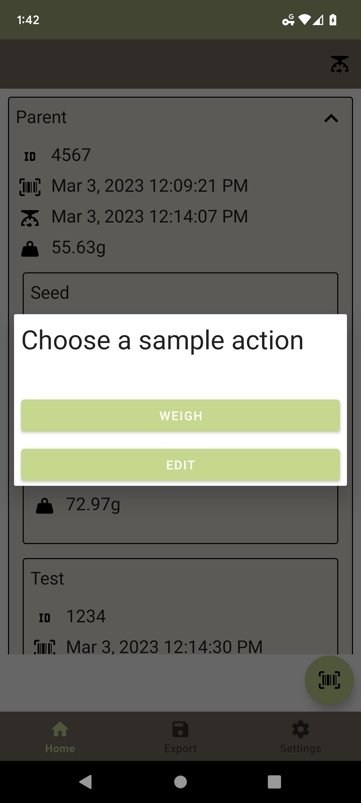
</p>

```
Test actions:
	1. Weigh: manual weigh screen
	2. Edit: open workflow screen in edit mode
	3. Scan: open scanner to fill barcode data
```

<p align="center">
	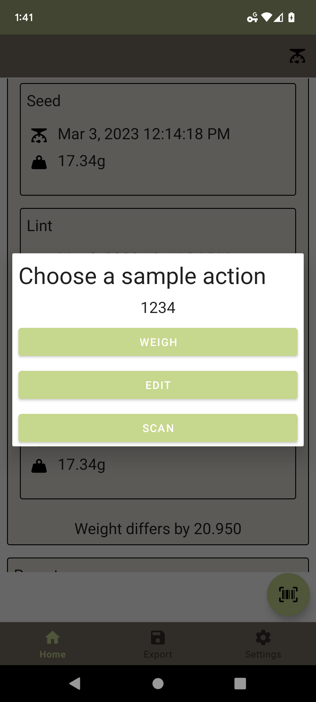
</p>

## Settings

Users can select scale addresses or clear them from the preferences.

<p align="center">
	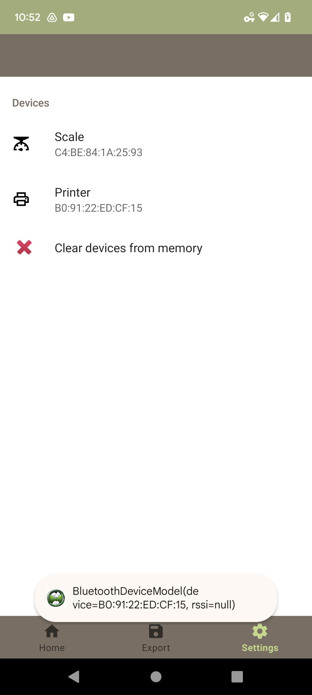
</p>


